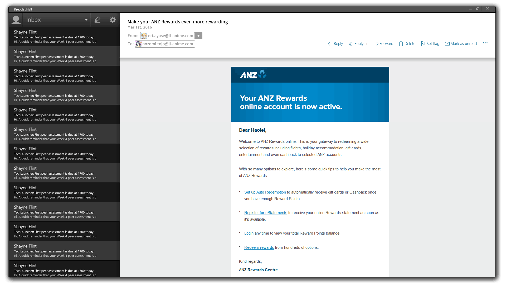
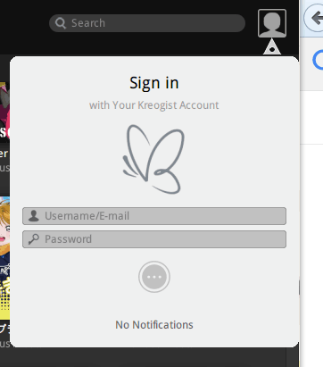
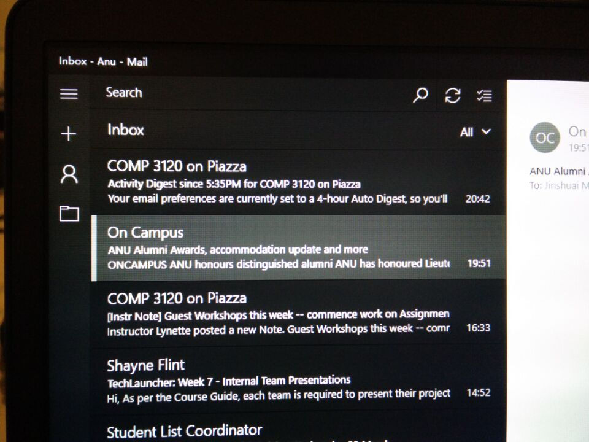
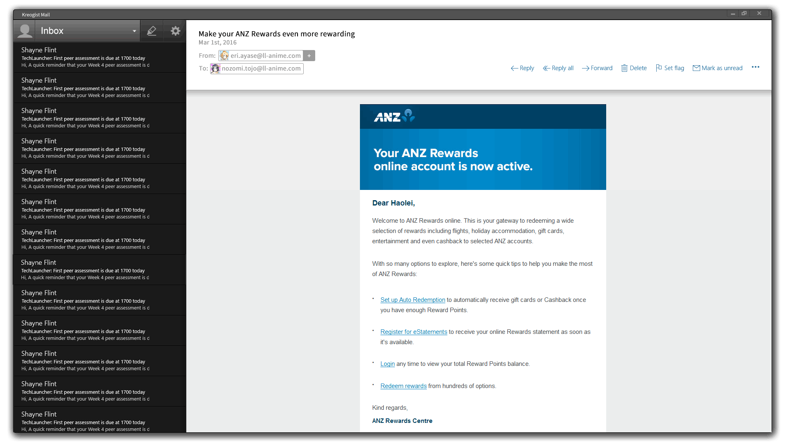
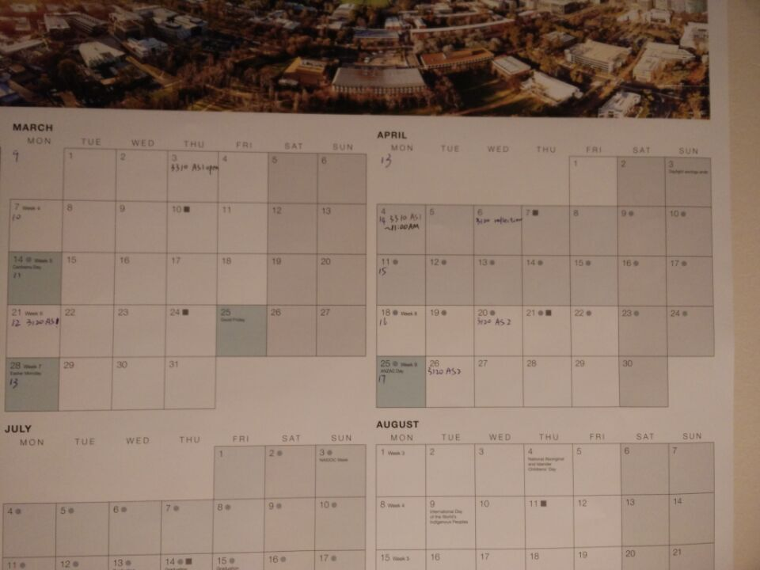

# Online meeting minutes from Kreogist Dev Team meeting 21.3.2016
21, March, 2016

Mayazure 22:02:41

Mayazure 22:04:42

my favorite emoji ever

Saki 22:05:09

It seems that you are pretty WeiSuo- -||||

Saki 22:07:19

Here is the latest design.

Saki 22:07:34

Saki 22:07:47

I change the layout of the right.

Saki 22:07:50

part

Saki 22:08:15

The plus after from means it's not in your address book.

Freddie 22:08:35

yeah

Freddie 22:08:57

that looks fine with me

Saki 22:08:58

It's a little bit different from the version I have just send you=w

Saki 22:09:04

Cool.

Saki 22:09:40

So, do you think we could called this flat design -w-

Freddie 22:09:44

maybe add a image for log in section

Mayazure 22:09:50

the font color on top right

Saki 22:10:03

log in section?

Saki 22:10:28

What do you mean by that...?

Mayazure 22:10:53

reply

Mayazure 22:10:58

balabala 

Freddie 22:11:00

i mean after click the profile 

Saki 22:11:05

ok...

Saki 22:11:26

To Ma: The color of reply is just copy the screen shot of W10 version.

Saki 22:11:44

yeah, of course.

Saki 22:12:07

Click the avatar on the top left it will pop up a window for login

Saki 22:12:12

Just like mu.

Saki 22:12:38

Saki 22:12:42

Something like this.

Saki 22:12:59

Maybe we could add our account system at the end of this project.

Saki 22:13:12

We could store the account information at local first.

Freddie 22:13:22

right

Saki 22:13:41

GJ

Mayazure 22:14:18

sure. What about highlight in inbox panel

Saki 22:14:31

Still on the way.

Saki 22:14:55

I didn't complete that yet.

Mayazure 22:16:31

Mayazure 22:16:46

win10 style

Saki 22:17:06

I think....

Saki 22:17:17

Well, in the dark style....

Saki 22:17:26

They all look the same...0 0

Saki 22:17:54

Mayazure 22:18:17

what do you mean

Saki 22:19:18

The only way to highlight one staff in the list of a dark theme, is to use a light grey to be the highlight band.

Saki 22:19:31

Change the color of text to FFF.

Mayazure 22:21:00

I mean the vertical line on the left

Mayazure 22:22:22

there is already light grey color in the list,  do you want to use a lighter color

Freddie 22:22:46

yes

Freddie 22:23:05

maybe a little bit lighter

Saki 22:24:30

Are you sure you want that line...?

Saki 22:24:34

Saki(858934854) 22:24:45

Here's an example of the highlight on the title bar.

Saki(858934854) 22:25:16

I'm still thinking about the high light version.

Saki(858934854) 22:25:24

I mean the list items.

Mayazure 22:25:41

it should be good if all the list item has the same grey background 

Mayazure 22:26:16

but I am not sure if they are dark grey and light grey

Saki(858934854) 22:26:38

You mean highlight?

Mayazure 22:27:46

Yes

Saki(858934854) 22:28:22

I will try.

Mayazure 22:30:51

and can you share the psd file

Mayazure 22:31:18

so that I can also have a try

Saki(858934854) 22:31:26

Okay, I will upload it.

Saki(858934854) 22:33:11

I will push it on GIthub.

Mayazure 22:33:25

good

Saki(858934854) 22:35:44

Already upload on Github.

Saki(858934854) 22:35:54

In today's folder. There's a PSD.

Saki(858934854) 22:36:53

Notice...

Saki(858934854) 22:37:01

Don't upload the changed PSD.

Saki(858934854) 22:37:18

If we change PSD in both side, it won't merge success.

Saki(858934854) 22:37:32

If you do save as, that will be good.

Saki(858934854) 22:41:18

I think I will to go and have a SuperMi...

Mayazure 22:42:40

ohh！I forget to buy it!

Mayazure 22:43:36

don't worry about that psd uploading... 

Saki(858934854) 22:45:05

hhhhhhhhhhhhhhhh

Saki(858934854) 22:45:10

Good luck.

Mayazure 22:47:50

Saki(858934854) 22:49:12

Maybe next time we could follow the Qt release chat log to send some agenda first?

Saki(858934854) 22:49:17

okay, forget it...

Mayazure 22:49:39

what is that

Freddie 23:02:43

QQ20160322000020.jpg

Freddie 23:03:07

we can see how we did in the first week

Freddie 23:03:14

from wattle now

Freddie 23:03:36

check your email box for a quick link

Saki(858934854) 23:03:57

So, the green is what we give ourselves?

Saki(858934854) 23:04:09

And the red one is what our tutor gives us?

Freddie 23:04:32

green on is the average score of all the teams

Saki(858934854) 23:05:11

ok, I get it.

Freddie 23:05:25

pretty sure we are above the average

Saki(858934854) 23:05:41

I want all 10...

Saki(858934854) 23:05:47

:(

Freddie 23:06:08

Kyle did gave us some suggest

Freddie 23:06:13

s

Freddie 23:06:27

can check them in the pdf

Saki(858934854) 23:06:41

Sure, and that's why we set up this forum :)

Freddie 23:07:13

and dont forget for this week's peer assessment

Saki(858934854) 23:07:47

I will do it tomorrow.

Saki(858934854) 23:08:38

Remind me :)

Saki(858934854) 23:08:54

QQ20160322000103.jpg

Saki(858934854) 23:11:57

Okay, so our plan for this week.

Saki(858934854) 23:12:13

1. Complete the rendering PSD, and complete the PPT.

Freddie 23:12:38

maybe dont be that rush

Freddie 23:13:01

our presentation will be on next Friday

Saki(858934854) 23:13:18

Yeah, of course.

Saki(858934854) 23:14:12

2. Complete some codes of the UI parts.

Saki(858934854) 23:14:47

3. Get the sample posters. So that we could analysis the poster after our presentation.

Freddie 23:15:08

no we cant

Saki(858934854) 23:15:23

Why...? What's the deadline of our posters?

Freddie 23:15:26

poster due on the same day we do presentation

Saki(858934854) 23:15:36

WTF....

Saki(858934854) 23:16:32

Maybe we could do our poster and presentation at the same time?

Saki(858934854) 23:16:43

Concurrent? @Ada @Uwe

Saki(858934854) 23:17:20

Okay, Thursday I will go to Shayne's office to check the posters.

Mayazure 23:17:54

we can do that tomorrow 

Saki(858934854) 23:18:17

Sure...? We all have lectures and tutorials?

Freddie 23:18:54

come on

Freddie 23:19:10

 we have two weeks to finish that

Freddie 23:19:17

don't be panic

Mayazure 23:19:48

not being panic, just curious 

Freddie 23:19:49

and we also have long weekend for easter

Saki(858934854) 23:20:25

I think we will spend those days on Pokemon.

Saki(858934854) 23:20:37

Love Live as well...

Freddie 23:20:40

hah

Mayazure 23:21:11

like your honesty

Saki(858934854) 23:23:19

Maybe we could put off all the coding staff?

Saki(858934854) 23:23:30

We have mid-term break?

Mayazure 23:24:55

Freddie 23:27:06

4.2-4.17

Saki(858934854) 23:27:29

Yeah, before 21st.

Saki(858934854) 23:27:49

We could put off all the coding staff next week, and leave it on mid-term break and after.

Freddie 23:32:48

agree

Saki(858934854) 23:33:27

Okay, let me clear our target next week again.

1. Finish the rendering PSD. Complete the PPT of presentation. (Could be delay a little.)

2. Get the sample posters. Finish analysising, complete the poster(Could be delay a little.)

Anything follow or need to modify?

Saki(858934854) 23:36:25

Cool. And that's all today.